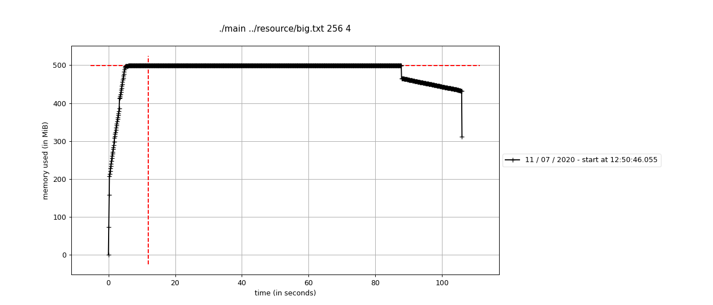

# 100GB

## 问题

有一个100GB的文件，里面内容是文本，要求：

1. 找出第一个不重复的词
2. 只允许扫一遍原文件
3. 尽量少的IO
4. 内存限制16G

## 分析

本问题是一个`out-of-core`去重的问题，只不过还需要记录一下单词的位置。

去重问题主要有两种解决思路：一种是`hash based`，即将原数据进行`hash`，重复的数据会`hash`到一起；另一种思路是`sort based`，即先对原数据进行排序，然后从头到尾遍历一遍即可。

对于`out-of-core`的问题，可以借鉴`external hash`和`external merge sort`的思路，把原始的大文件分成多个小块，每一块单独处理，最终合并到一起得到最终结果。

`sort based`的方法IO开销太大，因此这里采用了`hash based`的解决思路，具体步骤如下：

1. **split阶段**：读取原文件，根据`hash_func1`将`<word，index>`分为`P`个`partition`。如果某个`partition`过大，则用`hash_func2`再将此`partition`继续划分成更多的`sub-partition`，依此类推。
2. **find阶段**：读入每一个`partition`，找到该`partition`中下标最小的不重复的单词。遍历完所有的`partition`即可找到原始文件中下标最小的不重复的单词。

设原文件大小为`N`，理想情况下只需要进行`3N`（`2N + 1N`）的IO。

## 多线程

在`512M`的数据上进行测试时（`src/naive.cc`）发现读入数据只需要`7s`，但找到第一个不重复单词需要`88s`。磁盘的IO没有跑满，而且大部分时间都在内存中做计算。可以考虑用多线程来优化。

1. **split阶段**：通过`get_next_word_info_vec`每次获取一个`vector`的`<word, idx>`，通过`hash`将`vector`的内容分发给不同的`partition`，多个`partition`同时进行去重，写文件操作。
2. **find阶段**：多个`partition`同时寻找下标最小的不重复的单词。


在`512M`的数据上测试结果如下：

- 单线程：`2min28s`
- 4线程：`1min45s`

## 测试

由于题目数据太大，这里按比例缩小了数据量，减小为原来的1/200，有`512M`数据，内存限制`80M`。

起初我尝试用真实的英文语料（`resource/adv.txt`）生成数据，但是英文中常用的单词不过几万，数据量大的情况下在`split`阶段已经全部去重了，因此这里使用的是长度为`7`的随机字符串。

整个测试过程如下：

生成`512M`的数据（`resource/big.txt`）：

```bash
tools/gen_large_data.py
```

编译：

```bash
mkdir build && cd build
cmake ..
make -j
```

测试：

```bash
make test
```

运行，其中`partitions`表示原文件被分割成多少份，`threads`表示线程数：

```bash
# ./main <input> [partitions=16] [theads=1]
./main ../resource/big.txt 256 4
```

利用`memory_profiler`监控运行时内存：

```bash
# pip3 install memory_profiler
mprof run ./main ../resource/big.txt 256 4
mprof plot -o 512M-80M-256-4 --backend Agg
```

可以看到运行过程中总内存占用在`500M`左右，总用时`1min45s`。



## TODO

1. **内存占用**：目前内存开销还是很大。在`split`阶段可以通过控制写入磁盘的频率来控制内存占用。在`find`阶段可以考虑用其他的存储方法，比如不使用`std::string`而直接使用`char[7]`，不过需要提前知道单词的长度。
2. **IO效率**：目前`split`到磁盘上还是文本格式的`<word, idx>`。这里可以用二进制存储，并通过一定的压缩算法减少文件大小。还可以使用`double buffering`一边读取IO一边做计算。
3. **CPU效率**：目前`find`阶段可以每核可占用`100%`的CPU，但是`split`阶段每核只能占用`50%`的CPU。目前猜测是因为每次读入一个`vector`的`<word, idx>`后就要重新创建线程，未来可用线程池解决。

